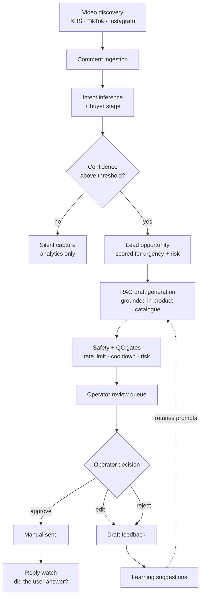

# Syntrae Platform

**A demand-capture engine for social commerce.** Syntrae watches short-video platforms for people who are already asking buying questions in the comments, classifies that intent, and drafts a reply for a human operator to review and send.

The premise is that most marketing spend chases attention from people who were never looking, while genuine buying intent is sitting unanswered in comment threads. Syntrae finds that intent, qualifies it, and turns it into a lead with a drafted response attached.

---

## Contents

- [What it does](#what-it-does)
- [How a lead flows through the system](#how-a-lead-flows-through-the-system)
- [Human-in-the-loop by default](#human-in-the-loop-by-default)
- [The feedback and learning loop](#the-feedback-and-learning-loop)
- [Architecture](#architecture)
- [Repository layout](#repository-layout)
- [Tech stack](#tech-stack)
- [Running locally](#running-locally)
- [Database migrations](#database-migrations)
- [Automation worker](#automation-worker)
- [Project status](#project-status)

---

## What it does

A brand connects its social accounts and uploads its product catalogue. From there the platform:

1. **Discovers** relevant videos on Xiaohongshu, TikTok and Instagram.
2. **Ingests** the comment threads under them.
3. **Infers intent** — is this person browsing, comparing, or ready to buy?
4. **Scores** the opportunity for confidence, urgency and risk.
5. **Drafts** a reply or DM grounded in the brand's actual product catalogue via RAG.
6. **Queues** the draft for a human operator to approve, edit or reject.
7. **Learns** from what the operator changed, and feeds that back into the prompts.

Each lead is classified along three axes that drive what happens next:

| Dimension | Values |
|---|---|
| `BuyerStage` | `AWARENESS` · `EVALUATING` · `READY` |
| `RecommendedAction` | `SILENT_CAPTURE` · `RECOMMEND_DM` · `PRIORITY_DM` |
| `LeadStatus` | `NEW` · `CONTACTED` · `QUALIFIED` · `CONVERTED` · `LOST` |

Not every detected opportunity is worth acting on. `SILENT_CAPTURE` exists so that low-signal comments are recorded for analytics without ever generating an outreach draft.

---

## How a lead flows through the system



---

## Human-in-the-loop by default

The system ships conservative. Every default in `OwnerSettings` is set so that a fresh workspace observes and suggests, but does not act on its own:

| Setting | Default | Effect |
|---|---|---|
| `mode` | `OBSERVE_ONLY` | Watch and classify; generate nothing |
| `aggressiveness` | `CONSERVATIVE` | Narrower intent matching |
| `automation_opt_in` | `false` | No autonomous sending |
| `reply_qualified_mode` | `MANUAL_REVIEW` | A human clears every reply |
| `reply_require_human_review_high_risk` | `true` | High-risk drafts always escalate |
| `auto_reply_confidence_threshold` | `0.9` | Very high bar before automation is even considered |
| `min_intent_confidence` | `0.7` | Weak signals never reach the queue |
| `max_suggestions_per_day` | `20` | Volume ceiling per workspace |
| `max_suggestions_per_video` | `2` | Prevents swarming a single thread |
| `cooldown_hours` | `24` | Minimum gap before re-engaging |

Operators move through modes deliberately — observe, then suggest, then assist. Beyond these settings, a dedicated safety layer (`services/safety/`) enforces rate limits and cooldowns independently of model output, so a misbehaving prompt cannot flood a comment section.

---

## The feedback and learning loop

The most useful signal in the system is what an operator *changes* before sending. Every review is captured as a typed `DraftFeedback` record rather than a thumbs up or down:

`ACCEPTED_AS_IS` · `EDITED_BEFORE_SEND` · `REJECTED` · `NEEDS_REWRITE` · `WRONG_STRATEGY` · `WRONG_TONE` · `TOO_AI` · `TOO_SALESY` · `TOO_VAGUE` · `UNSAFE_OR_OVERCLAIM`

These feed a mining step that produces `LearningSuggestion` records, which are grouped into a `LearningApplyPlan` of concrete `ApplyCandidate` prompt changes. An operator reviews the plan before anything is applied — the system proposes its own retuning, but does not self-modify.

Prompt changes are held to versioned eval baselines in [`docs/evals/`](docs/evals). Each revision is scored against a fixed set of real human feedback records, so a change that fixes one failure mode but regresses another is visible before it ships. The v8 baseline, for example, tracks unwanted attribute injection and average reply length across 50 records for a single brand and platform.

---

## Architecture

A pnpm monorepo of TypeScript services and UIs alongside a Python AI core, orchestrated with Docker Compose behind nginx.

```
                       ┌─────────────┐
   Browser extension ─▶│    nginx    │◀─ Operator / Admin / Marketing UIs
   (XHS session)       └──────┬──────┘
                              │
        ┌─────────────────────┼─────────────────────┐
        ▼                     ▼                     ▼
  ┌───────────┐        ┌─────────────┐       ┌─────────────┐
  │ operator- │        │ ingestion-  │       │  ai-core    │
  │    api    │        │  service    │──────▶│  (FastAPI)  │
  │   (TS)    │        │    (TS)     │       │             │
  └─────┬─────┘        └──────┬──────┘       └──────┬──────┘
        │                     │                     │
        │              ┌──────▼──────────┐   ┌──────▼──────┐
        │              │ video-detection │   │   Qdrant    │
        │              │  engine (Py)    │   │  (vectors)  │
        │              └──────┬──────────┘   └─────────────┘
        │                     │
        │              ┌──────▼──────────┐
        │              │   automation-   │
        │              │ worker (scaled) │
        │              └─────────────────┘
        │                     │
        └──────────┬──────────┘
                   ▼
        ┌──────────────────────┐
        │ PostgreSQL  ·  Redis │
        └──────────────────────┘
```

| Service | Language | Role |
|---|---|---|
| `ai-core` | Python / FastAPI | RAG pipeline, intent inference, draft generation, evals |
| `ingestion-service` | TypeScript | Comment ingestion, lead pipeline, safety gates, HITL queue |
| `operator-api` | TypeScript | Auth, workspaces, suggestion queue, analytics |
| `operator-ui` | React + Vite | Operator console — queue, detail view, settings |
| `admin-ui` | React + Vite | Internal administration |
| `marketing-ui` | React + Vite | Public marketing site |
| `video-detection-engine` | Python | Platform discovery and video/comment capture |
| `automation-worker` | Python | Horizontally scaled browser automation |
| `xhs-session-extension` | Browser extension | Captures a user's Xiaohongshu session by consent |
| `db-migrate` | Prisma | Owns the schema; runs migrations as a one-shot job |

**Schema ownership is deliberately one-way.** Only the `db-migrate` service creates or alters tables. The Python services read and write the database but never own the schema — they expect it pre-created. This keeps a polyglot stack from racing each other on migrations at startup.

### AI core internals

`apps/ai-core/src/ai_core/` is organised around a capability registry (`observe`, `score`, `search`, `extract`, `answer`, `recommend`, `execute`, `govern`) with an orchestrator that composes them into flows.

The RAG pipeline under `pipeline/` is split into discrete stages — `intent`, `embedding`, `retriever`, `reranker`, `fusion`, `draft`, `qc`, `formatter`, `structured`, `feedback`, `memory`, `eval` — plus `cache` and `fallback` layers so a model or vector-store outage degrades rather than fails.

Data connectors for Google Drive, SharePoint and Salesforce live under `connectors/`, letting a brand ground drafts in documents it already keeps elsewhere.

---

## Repository layout

```
apps/
  admin-ui/                internal admin console (React + Vite)
  ai-core/                 Python FastAPI AI service + RAG pipeline
  ingestion-service/       TypeScript ingestion, lead pipeline, safety
  marketing-ui/            public marketing site (React + Vite + Tailwind)
  operator-api/            TypeScript backend for the operator console
  operator-ui/             operator console (React + Vite + Tailwind)
  video-detection-engine/  Python platform discovery + capture
  xhs-session-extension/   Chromium/Firefox session connector

packages/
  commercial-plans/        plan and entitlement definitions
  domain-models/           shared domain types
  intent-taxonomy/         intent category definitions
  llm-contracts/           typed request/response contracts for model calls
  prisma-schema/           the single source of truth for the database
  shared-config/           shared configuration

infra/
  compose/                 Docker Compose stacks (prod + local variants)
  docker/                  service Dockerfiles
  nginx/                   edge configuration and TLS

docs/
  evals/                   versioned prompt-quality baselines
  operator/                operator-facing QA notes
  local-docker.md          local stack walkthrough
```

---

## Tech stack

**Backend** — FastAPI, SQLAlchemy, Alembic, Node.js/TypeScript, Prisma
**AI/ML** — OpenAI, LangChain, tiktoken, sentence-transformers, Qdrant, LightGBM, scikit-learn
**Data** — PostgreSQL (multi-schema), Redis, Qdrant
**Frontend** — React, Vite, TypeScript, Tailwind CSS
**Document ingestion** — PyPDF2, pdfplumber, python-docx, python-pptx, openpyxl, pandas
**Ops** — Docker Compose, nginx, certbot, structlog, Sentry, Prometheus
**Tooling** — pnpm workspaces, pytest, Prettier, Black, mypy

---

## Running locally

Requires Docker and Docker Compose.

The quickest path is the helper script at the repo root, which creates the bind-mount directories first so Docker does not create them as root:

```bash
./start_local.sh
```

That brings up the local stack and exposes:

| Service | URL |
|---|---|
| Operator UI | http://localhost:8080 |
| Operator API | http://localhost:3001 |
| Ingestion service | http://localhost:3005 |
| AI Core API | http://localhost:8000 |

Stop it with `./stop_local.sh`.

Configuration is read from `.env.local` at the repo root. Leave `LOCAL_OPENAI_API_KEY` blank to exercise the UI, API and database without making live model calls; set it when you need real generation.

For the full nginx-fronted stack over TLS — closer to production, and what you want when testing the edge or the browser extension — follow [`docs/local-docker.md`](docs/local-docker.md).

---

## Database migrations

This platform uses a dedicated service for running Prisma migrations. The application containers (Node.js/Python) **do not** run migrations automatically on startup.

**To migrate the database:**

1.  Start the infrastructure (Postgres):
    ```bash
    docker compose up -d postgresql
    ```

2.  Run the migration service:
    ```bash
    cd infra/compose

    # Run ephemeral migration container
    docker compose run --rm db-migrate
    ```

    This will:
    *   Connect to the database
    *   Apply any pending migrations from `packages/prisma-schema/migrations`
    *   Exit automatically

3.  Start the rest of the stack:
    ```bash
    docker compose up -d
    ```

> **Note on migration paths.** `db-migrate` runs `prisma migrate deploy` from inside
> `packages/prisma-schema` with no `--schema` flag. Prisma therefore resolves
> `./schema.prisma` and applies migrations from `./migrations` — the sibling
> `packages/prisma-schema/prisma/migrations/` directory is **not** read, and the single
> migration sitting there is orphaned. Add new migrations to
> `packages/prisma-schema/migrations/` only.

---

## Automation worker

The production worker service is defined in [`infra/compose/docker-compose.yml`](infra/compose/docker-compose.yml).

- `automation-worker` is intended to scale horizontally, so it should not use a fixed `container_name`.
- Each replica derives a unique worker id from `AUTOMATION_WORKER_ID` or the container hostname.
- Brand-scoped browser sessions live under:
  ```text
  /data/storage/sessions/<brand_id>/<platform>/session.json
  ```
- Capture a brand-scoped session with:
  ```bash
  python main_automation.py login --platform xiaohongshu --brand-id <brand_id>
  ```

---

## Project status

Active work in progress, not a finished product. The core loop — discovery, ingestion, intent inference, RAG drafting, operator review, feedback mining — is implemented end to end and exercised by the eval baselines in `docs/evals/`. Individual platform connectors are at different levels of maturity; Xiaohongshu is the most developed, with TikTok and Instagram behind it.

Development happens on feature branches merged into `main`. Treat anything on a `feature/` or `codex/` branch as unstable.
